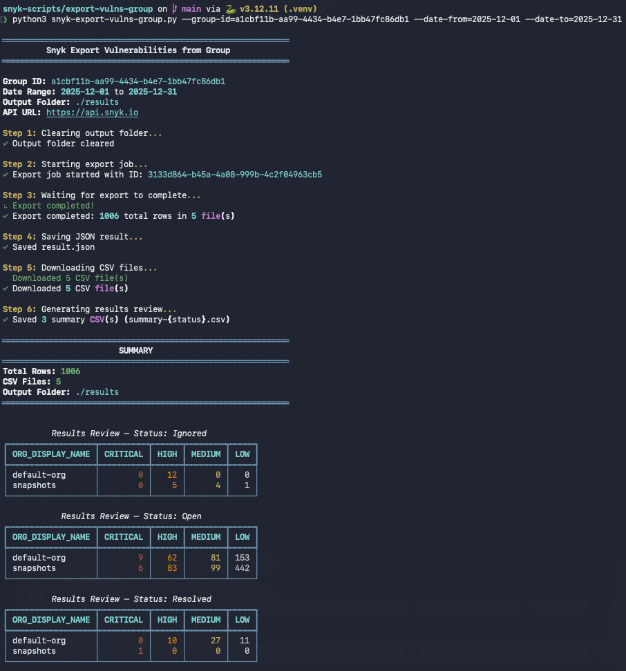

# Snyk Export Vulnerabilities from Group

Export vulnerabilities from a Snyk group for a date range using the [Snyk Export API](https://api.snyk.io). The script starts an export job, waits for completion, downloads CSV data, and for each issue status generates an **issues** CSV (all issues of that status) and a **summary** CSV (counts by org and severity). Results are saved as JSON, CSV, and daily log files.

## Prerequisites

- **Python 3** (3.8+)
- **Snyk API token** with access to the group you want to export from

---

## Setup

### 1. Go to the project directory

```bash
cd export-vulns-group
```

### 2. Create a virtual environment (recommended)

```bash
python3 -m venv .venv
source .venv/bin/activate   # On Windows: .venv\Scripts\activate
```

### 3. Install dependencies

```bash
pip install -r requirements.txt
```


### 4. Set your Snyk API token

The script requires `SNYK_TOKEN` to call the Snyk API.

**Option A – current shell:**

```bash
export SNYK_TOKEN="your-snyk-api-token"
```

**Option B – `.env` file (recommended):**

Create a `.env` file in the project directory:

```
SNYK_TOKEN=your-snyk-api-token
```

The script loads `.env` automatically via `python-dotenv`. Do not commit `.env` or your token to version control.

---

## Run

### Required arguments

| Argument       | Description                          |
|----------------|--------------------------------------|
| `--group-id`   | Snyk Group ID                        |
| `--date-from`  | Start date in `YYYY-MM-DD` format    |
| `--date-to`    | End date in `YYYY-MM-DD` format      |

### Optional arguments

| Argument          | Default                | Description                                                                 |
|-------------------|------------------------|-----------------------------------------------------------------------------|
| `--output-folder` | `./results`            | Directory for all output files (created if missing; cleared at each run)   |
| `--api-url`       | `https://api.snyk.io`  | Snyk API base URL                                                          |
| `--api-version`   | `2024-10-15`           | Export API version                                                         |

### Example

```bash
python3 snyk-export-vulns-group.py \
  --group-id=your-group-id \
  --date-from=2025-01-01 \
  --date-to=2025-01-31
```

With a custom output folder and API options:

```bash
python3 snyk-export-vulns-group.py \
  --group-id=your-group-id \
  --date-from=2025-01-01 \
  --date-to=2025-01-31 \
  --output-folder=./my-export \
  --api-url=https://api.snyk.io \
  --api-version=2024-10-15
```

### Help

```bash
python3 snyk-export-vulns-group.py --help
```

### What the script does when you run it

1. **Validates** `SNYK_TOKEN`, `--group-id`, and date arguments (format `YYYY-MM-DD`, and that `--date-from` ≤ `--date-to`).
2. **Clears** the output folder (deletes existing files from a previous run).
3. **Starts** an export job via the Snyk Export API for the given group and date range (issues *introduced* in that range).
4. **Polls** the job status every second until it is `FINISHED`.
5. **Saves** the full API response as `result.json` in the output folder.
6. **Downloads** each CSV from the export result URLs as `csv_1.csv`, `csv_2.csv`, … into the output folder.
7. **Generates a results review** (per `ISSUE_STATUS`):
   - **Issues:** For each distinct `ISSUE_STATUS`, creates `issues-{status}.csv` (e.g. `issues-Open.csv`, `issues-Resolved.csv`) containing all issues of that status, with the same columns as the raw export (SCORE, CVE, CWE, PROJECT_NAME, ORG_DISPLAY_NAME, ISSUE_SEVERITY, ISSUE_STATUS, etc.).
   - **Summary:** For each status, creates `summary-{status}.csv` with columns `ORG_DISPLAY_NAME`, `CRITICAL`, `HIGH`, `MEDIUM`, `LOW` — counts of issues by organization and severity for that status.
   - **Console:** Prints one Rich table per status showing the summary data.

---

## Results

All outputs are written to the folder given by `--output-folder` (default: `./results`). The script creates this folder if it does not exist and **clears it at the start of each run**.

### Files produced

| File                     | Description                                                                                                                                 |
|--------------------------|---------------------------------------------------------------------------------------------------------------------------------------------|
| `result.json`            | Full API response for the completed export job: metadata, status, and list of result URLs with `url`, `file_size`, and `row_count`.        |
| `csv_1.csv`, `csv_2.csv`, … | Raw export data from the Snyk Export API. One file per chunk; columns include `GROUP_PUBLIC_ID`, `ORG_DISPLAY_NAME`, `ISSUE_SEVERITY`, `ISSUE_STATUS`, `PROBLEM_TITLE`, `CVE`, `CWE`, `PROJECT_NAME`, `FIRST_INTRODUCED`, etc. |
| `issues-{status}.csv`    | One file per `ISSUE_STATUS` (e.g. `issues-Open.csv`, `issues-Resolved.csv`). All issues of that status with the same columns as the raw export. Use these to filter or analyze by status. |
| `summary-{status}.csv`   | One file per `ISSUE_STATUS` (e.g. `summary-Open.csv`, `summary-Resolved.csv`). Columns: `ORG_DISPLAY_NAME`, `CRITICAL`, `HIGH`, `MEDIUM`, `LOW` — counts of issues by org and severity for that status. |
| `YYYYMMDD.log`           | Daily log file (date of the run). All steps and errors are logged here for debugging.                                                     |

### Console output

- Progress messages and checkmarks for each step (clear folder, start export, wait, save JSON, download CSVs, generate issues and summary CSVs per status).
- One **Rich table per issue status** showing the same summary data as `summary-{status}.csv` (org name and Critical/High/Medium/Low counts).
- A final **summary** with total row count, number of CSV files downloaded, and the output folder path.



### Finding your Group ID

In the Snyk UI, open your **Group** settings. The Group ID is in the URL (e.g. `https://app.snyk.io/group/<group-id>`) or on the group settings page.

---

## Troubleshooting

- **`SNYK_TOKEN environment variable is not set`**  
  Set `SNYK_TOKEN` (see [Set your Snyk API token](#4-set-your-snyk-api-token)) or ensure your `.env` file is in the script’s working directory.

- **`--date-from` / `--date-to` must be in YYYY-MM-DD format**  
  Use dates like `2025-01-01`. The script checks that they are valid calendar dates and that `--date-from` is not after `--date-to`.

- **HTTP 401 / 403**  
  Confirm your token is valid and has access to the given group.

- **Export never finishes**  
  Large date ranges or groups can take longer. The script polls every second; check the `YYYYMMDD.log` file in the output folder for details.
